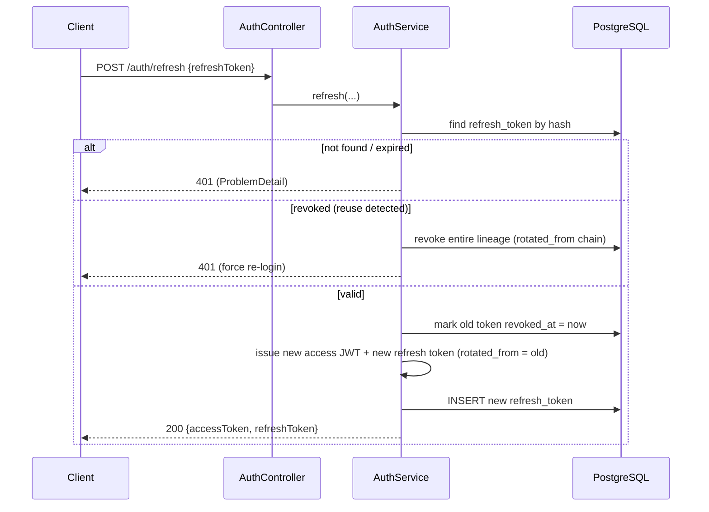
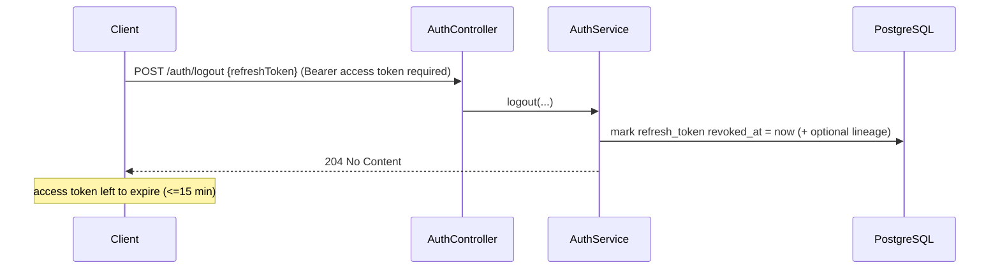

# backend-foundations — Technical Design

Modular Spring Boot 4 backend foundation: verified Spring Modulith boundaries, JWT auth in the `iam` module, and enforced Clinic isolation driven by the authenticated JWT. This design is the architectural HOW; task breakdown and PR slicing belong to `sdd-tasks`.

**Authority note:** every decision below is grounded in the REAL code (`api/pom.xml`, `ApiApplication.java`, `application.yaml`, the Testcontainers scaffolding) and the `cognitive-doc-design` skill. The legacy prose in `webapp-zendent/docs/plan/` (Gradle, `com.zendenta`, "@Filter") is treated as STALE input, not as a constraint. Where this design deviates from that prose, the rationale is stated explicitly.

---

## Decision summary (read this first)

| # | Decision area | Verdict |
|---|---------------|---------|
| D1 | Module layout & base package | Move `ApiApplication` to `com.zendent`; modules = `iam` (closed) + `shared` (open); app config in base package. |
| D2 | Clinic isolation enforcement | Two mandatory layers: Hibernate **`@TenantId`** on the ORM path and PostgreSQL **Row-Level Security** on every Clinic-owned table. Two Clinic sources: the **subdomain** (`avicena.zendent.app`) for public requests, the **JWT `clinic_id`** (authoritative) for authenticated requests. |
| D3 | JWT auth & stateless logout | HS256 access token (short TTL) + **rotating refresh token in a revocable server-side store**. Login is **subdomain-scoped** (body is `{email, password}`). Logout/revocation act on the refresh token. |
| D4 | iam persistence | `clinic` (Clinic root, global), `app_user` (global identity), `role` (global catalog), `membership` (Clinic-owned), `refresh_token`, `staff_invitation`. Flyway `V1__init.sql` baseline. |
| D5 | DTO mapping | Adopt **MapStruct** as the standard, contingent on JDK 25 processor verification in PKG-2.1; documented hand-written fallback if the processor fails on JDK 25. |
| D6 | Events | Modulith JPA event-publication registry (outbox); `ClinicCreatedEvent` contract in `shared`; publish via `ApplicationEventPublisher`, consume via `@ApplicationModuleListener`. |
| D7 | Error handling | RFC 7807 `ProblemDetail` via `@RestControllerAdvice` in `shared`, plus a Security `AuthenticationEntryPoint`/`AccessDeniedHandler` for filter-chain errors. |

**Out-of-band blocker (not designed here):** the monorepo git reconciliation from the proposal (`webapp-zendent/.git` vs a product-root repo) must be resolved BEFORE the first backend commit. It is acknowledged as a prerequisite, not designed in this document.

---

## D1 — Module layout & Spring Modulith boundaries

### Verdict
- **Move the application class** `com.zendent.api.ApiApplication` → `com.zendent.ApiApplication`. Update its package declaration and the three test classes (`ApiApplicationTests`, `TestApiApplication`, `TestcontainersConfiguration`) from `com.zendent.api` → `com.zendent`.
- Spring Modulith derives the module base package from the `@SpringBootApplication` class package. With the class at `com.zendent`, each **direct sub-package becomes a module**, which is exactly the layout the proposal requires (`com.zendent.iam`, `com.zendent.shared`). Leaving the class at `com.zendent.api` would force modules to be `com.zendent.api.iam` — contradicting the proposal. This move is mandatory, not cosmetic.

### Package map

```
com.zendent
├─ ApiApplication.java              # @SpringBootApplication (base package)
├─ SecurityConfig.java              # app-wide security filter chain, JwtEncoder/Decoder beans
├─ OpenApiConfig.java               # Springdoc bean + JWT bearer security scheme
├─ shared/                          # OPEN module (infrastructure, freely referenced)
│   ├─ package-info.java            # @ApplicationModule(type = Type.OPEN)
│   ├─ tenancy/                     # TenantContext, TenantIdentifierResolver, TenantFilter
│   ├─ events/                      # ClinicCreatedEvent + future domain event contracts
│   ├─ web/                         # GlobalExceptionHandler (ProblemDetail), security error handlers
│   └─ domain/                      # Money, typed ids, PageResponse (value objects)
└─ iam/                             # CLOSED module
    ├─ package-info.java            # @NamedInterface for the public surface (if any)
    ├─ domain/                      # Clinic, User, Role, Membership, RefreshToken, StaffInvitation (JPA)
    ├─ web/                         # @RestController + request/response DTOs
    ├─ mapper/                      # MapStruct mappers (D5)
    ├─ internal/                    # services, repositories, JWT service, password encoder wiring
    └─ IamService.java / ports      # (optional) public application services
```

### Boundary rules (Modulith semantics)
| Concern | Rule |
|---------|------|
| `shared` visibility | Marked `type = OPEN` via `package-info.java` so any module may depend on it without an explicit `allowedDependencies` entry. Holds ONLY cross-cutting infra + published contracts, never business logic. |
| `iam` visibility | Closed. Its internals (`domain`, `internal`, `web`, `mapper`) are module-private by Modulith default. Anything other modules must see is exposed via a `@NamedInterface` (e.g. `iam.api`) or, preferably, via published events in `shared`. |
| Cross-module coupling | In Phase 2 the only cross-module contract is `ClinicCreatedEvent` (published by `iam`, contract owned by `shared`). No `iam → other` or `other → iam` compile-time dependency exists yet. |
| App config | `SecurityConfig`/`OpenApiConfig` live in the base package `com.zendent` (part of the application, not a module) so they are not mistaken for a business module. |

### Verification wiring
- Architecture test `com.zendent.ModularityTests`:
  - `ApplicationModules.of(ApiApplication.class).verify()` — fails the build on illegal cross-module access or cycles.
  - `new Documenter(modules).writeDocumentation()` — emits PlantUML/AsciiDoc under `target/spring-modulith-docs/` (satisfies the proposal's "module docs generated" success criterion).
- This runs as a plain JUnit test (no Spring context needed), so it is fast and always in the Surefire run behind `./mvnw test`.

### Rejected alternatives
- **Keep main class at `com.zendent.api`.** Rejected: modules would be nested under `api`, breaking the `com.zendent.iam` layout the proposal mandates and every later phase assumes.
- **Put Clinic-isolation/error handling in the base package instead of `shared`.** Rejected: they are reusable infrastructure that business modules must reference; an OPEN `shared` module is the idiomatic Modulith home and keeps the base package limited to bootstrap wiring.

---

## D2 — Clinic isolation enforcement (the crux)

### Verdict: Hibernate `@TenantId` plus PostgreSQL RLS

Every Clinic-owned table in the shared schema carries `clinic_id`. Isolation is
enforced by two independent, mandatory layers:

1. **Hibernate `@TenantId`** adds the Clinic discriminator on the ORM path and is
   driven by a `CurrentTenantIdentifierResolver` that reads the request-scoped
   `TenantContext`.
2. **PostgreSQL Row-Level Security (RLS)** protects the same rows below the ORM.
   The application connects as a restricted role that neither owns the tables
   nor has `SUPERUSER` or `BYPASSRLS`; every Clinic-owned table enables and
   forces RLS. At transaction start, `ClinicTransactionListener` publishes the
   active Clinic through `SET LOCAL app.clinic_id`.

`SET LOCAL` is transaction-scoped, so a pooled connection cannot carry one
Clinic's setting into later work. If no Clinic is active, no setting is
published: policies return zero rows and reject writes without raising a
missing-setting error.

### Why `@TenantId` over `@Filter` (rationale)
| Criterion | `@Filter` (`@FilterDef` + `session.enableFilter`) | `@TenantId` (chosen) |
|-----------|---------------------------------------------------|----------------------|
| Applies to `find()`/`getReference()` by id | **No** — direct primary-key loads bypass the filter → cross-Clinic leak on `em.find(Patient, otherClinicId)` | **Yes** — Hibernate appends the Clinic predicate to `find()` too |
| Enabled by default per session | **No** — must call `enableFilter` on every session or queries return ALL Clinics silently | **Yes** — always active once the resolver returns a Clinic |
| Write safety (INSERT) | **No** — filter is read-only; `clinic_id` must be set manually or rows have no Clinic attribution | **Yes** — Hibernate auto-populates the discriminator on persist |
| Failure mode | Silent full-table exposure if a developer forgets to enable | Fails loud / stays scoped |

For a **security foundation with mandatory isolation tests**, the `@Filter` footguns (id-load leak, forget-to-enable, no write guard) are unacceptable. The stale architecture prose picked `@Filter`; this design overrides it with `@TenantId` on the explicit grounds above. We are on Hibernate 7 (via Boot 4), where `@TenantId` + `CurrentTenantIdentifierResolver` is first-class and Spring Boot auto-detects the resolver bean.

### Why both isolation layers remain mandatory

| Failure mode | `@TenantId` | PostgreSQL RLS |
|--------------|-------------|----------------|
| ORM listing or primary-key load forgets Clinic scoping | Prevents it and auto-populates `clinic_id` on writes | Independently rejects rows outside the active Clinic |
| Native query, maintenance job, data script, or direct application-role SQL bypasses Hibernate | Cannot observe or protect this path | Applies in the database regardless of caller code |
| Active Clinic is missing | Hibernate cannot safely access `@TenantId` entities | Fails closed: reads return no rows and writes are rejected |
| Deployment uses a role that can bypass policies | Cannot detect the database privilege error | Startup guard refuses the unsafe role; `FORCE ROW LEVEL SECURITY` removes the ownership exemption |

The layers are complementary, not redundant. Removing `@TenantId` loses ORM
ergonomics and discriminator write handling; removing RLS turns any path around
Hibernate into a silent cross-Clinic exposure.

### What is Clinic-owned vs global (critical nuance)
`@TenantId` requires a resolvable Clinic for annotated entities. Authentication must work BEFORE a Clinic is known, so identity tables are deliberately global:

| Entity | Clinic-owned? | Reason |
|--------|----------------|--------|
| `Clinic` | No (it IS the Clinic root) | Looked up by slug pre-auth; carries its own id, not a foreign `clinic_id` filter. |
| `User` (`app_user`) | No (global identity) | Email is globally unique; loaded by email at login before Clinic context exists. |
| `Role` | No (global catalog) | System roles (ADMIN, DENTIST, STAFF...). |
| `Membership` | **Yes** (`@TenantId clinicId`) | The user↔Clinic↔role join; Memberships must be isolated by Clinic. |
| Future business entities (Patient, Appointment, Charge...) | **Yes** | Inherit automatic isolation via `@TenantId`. |

Every new Clinic-owned table MUST create its RLS policy in the same Flyway
migration that creates the table. Deferring the policy would leave the table
silently unprotected. The catalog-driven RLS test enumerates tables carrying
`clinic_id`, so a migration that omits `ENABLE`, `FORCE`, or a policy fails the
build.

Because login is **subdomain-scoped** (see D3 and the two-source precedence below — the Clinic slug is derived from the request Host, not the body), the Clinic context is established from the subdomain BEFORE `Membership` is touched, so `@TenantId` never blocks the auth flow. This removes the classic "cross-Clinic lookup at login" problem without needing a bypass mechanism.

### Two Clinic sources & precedence rule (explicit)
The Clinic for a request comes from one of two sources, with a strict precedence:

| Request kind | Clinic source | Rule |
|--------------|---------------|------|
| **Public** (no JWT: `/auth/login`, `/auth/register` on a Clinic subdomain, `/auth/refresh`, invitation accept) | **Subdomain** (Host header) | The subdomain is the SOLE Clinic source. Slug → `Clinic` lookup → `TenantContext`. |
| **Authenticated** (valid JWT present) | **JWT `clinic_id`** — AUTHORITATIVE | The Clinic comes from the token. The subdomain MUST MATCH the JWT `clinic_id`; a mismatch (a Clinic A token replayed on Clinic B's subdomain) MUST be rejected with **403**. |

The subdomain is derived SERVER-SIDE from the Host header — never sent as a client field — so it cannot be spoofed by a body parameter, and the JWT-vs-subdomain cross-check closes token replay across Clinics.

### Components
| Component | Location | Order in chain | Responsibility |
|-----------|----------|----------------|----------------|
| `TenantContext` | `shared.tenancy` | — | `ThreadLocal<UUID>` holding the current `clinic_id`; `set`/`get`/`clear`. Thread-per-request MVC → ThreadLocal is safe. |
| `ClinicTransactionListener` | `shared.tenancy` | **AFTER transaction begin** | Reads `TenantContext` and issues transaction-local `set_config('app.clinic_id', ..., true)` on the transaction-bound connection. Skips the setting when no Clinic is active. |
| `SubdomainTenantResolutionFilter` | `shared.tenancy` | **EARLY** (before/independent of JWT auth) | `OncePerRequestFilter`. Extracts the subdomain from the Host header; if it is a Clinic subdomain, resolves `Clinic` by slug (global lookup) and calls `TenantContext.set(...)`. Skips apex/onboarding hosts (see D3). `clear()` in `finally`. This is what lets PUBLIC auth endpoints know the Clinic before any JWT exists. |
| `ClinicTenantIdentifierResolver` | `shared.tenancy` | — | Implements Hibernate `CurrentTenantIdentifierResolver<UUID>`; returns `TenantContext.get()`. Spring Boot auto-wires it into the `SessionFactory`. |
| `TenantContextFilter` | `shared.tenancy` | **AFTER JWT auth** | `OncePerRequestFilter`. When authenticated, reads `clinic_id` from the JWT claims (AUTHORITATIVE), asserts it MATCHES the Clinic already resolved by `SubdomainTenantResolutionFilter` (else 403), and overwrites `TenantContext` with the JWT Clinic. |

**Chain ordering:** `SubdomainTenantResolutionFilter` (early, sets the Clinic from Host) → JWT auth filter (resource-server, validates token) → `TenantContextFilter` (authoritative JWT Clinic + subdomain match check). Public requests are fully Clinic-scoped by the first filter alone.

### Sequence — request → auth → Clinic set → filtered query

```mermaid
sequenceDiagram
    participant C as Client
    participant SUB as SubdomainTenantResolutionFilter
    participant JWT as JwtAuthFilter (resource-server)
    participant TF as TenantContextFilter
    participant Ctrl as Controller/Service
    participant Repo as JPA Repository
    participant H as Hibernate + Clinic resolver
    participant TX as ClinicTransactionListener
    participant DB as PostgreSQL

    C->>SUB: GET https://avicena.zendent.app/api/... (Bearer access token)
    SUB->>SUB: extract subdomain "avicena" from Host; resolve Clinic by slug
    SUB->>SUB: TenantContext.set(clinic_id from subdomain)
    SUB->>JWT: proceed
    JWT->>JWT: validate signature + exp, build Authentication (sub, clinic_id, roles)
    JWT->>TF: authenticated request
    TF->>TF: assert JWT clinic_id == subdomain clinic_id (else 403)
    TF->>TF: TenantContext.set(clinic_id from JWT — authoritative)
    TF->>Ctrl: proceed
    Ctrl->>Repo: findMembers()
    Repo->>H: HQL / find()
    H->>H: resolver.resolveCurrentTenantIdentifier() = clinic_id
    H->>DB: BEGIN
    H->>TX: transaction started
    TX->>DB: SET LOCAL app.clinic_id = clinic_id
    H->>DB: SELECT ... WHERE clinic_id = :clinic
    DB->>DB: RLS independently enforces app.clinic_id
    DB-->>Ctrl: only current Clinic rows
    Ctrl-->>TF: response
    TF->>TF: TenantContext.clear() (finally)
    TF-->>C: 200
```

### Mandatory isolation tests

The database-enforcement gate uses the restricted application `DataSource` and
native SQL against Testcontainers. It seeds rows for Clinic A and Clinic B,
verifies reads and writes with and without an active Clinic, enumerates every
`clinic_id` table from the PostgreSQL catalog, and forces pool reuse to prove
that `SET LOCAL` leaves no residue.

A repository-only test cannot prove RLS: it would remain green if PostgreSQL
policies disappeared because Hibernate `@TenantId` would still filter the same
rows. Repository and HTTP tests remain useful for the ORM and request-context
layer, but they do not replace the native RLS gate.

### Rejected alternatives
- **Plain `@Filter`** — rejected for the four failure modes in the table above.
- **Separate schema/database per Clinic** — rejected: over-provisions for a dental-SaaS scale and contradicts the chosen shared-schema model; migration and connection management cost is not justified now.

---

## D3 — JWT auth & the stateless-logout problem

### Token strategy
| Aspect | Decision |
|--------|----------|
| Access token | JWT, short TTL (**15 min**), stateless, never stored server-side. Claims: `sub` (user id), `clinic_id`, `roles` (array), `email`, `iss`, `iat`, `exp`, `jti`. |
| Refresh token | Opaque high-entropy random string (NOT a JWT), longer TTL (**e.g. 14 days**), stored server-side **hashed**, one-time-use with rotation. |
| Signing | **HS256 symmetric** (shared secret per profile from env/config). |
| Password hashing | BCrypt (`BCryptPasswordEncoder`). |

**Symmetric vs asymmetric rationale:** the same monolith both issues and validates tokens, so a single HMAC secret (HS256) is the simplest correct choice — no keypair distribution, no JWKS endpoint. Asymmetric (RS256/ES256) is only warranted when an independent party must validate without holding the signing secret. Migration to RS256 later is a config-level change (swap `NimbusJwtEncoder`/`Decoder` key material) and is noted as a low-cost future option, not built now.

### Library / pom impact
The current pom has `spring-boot-starter-security` but **no JWT library**. Add:
```xml
<dependency>
  <groupId>org.springframework.boot</groupId>
  <artifactId>spring-boot-starter-oauth2-resource-server</artifactId>
</dependency>
```
This pulls `spring-security-oauth2-jose` (Nimbus), giving both `NimbusJwtDecoder` (validation via `oauth2ResourceServer().jwt()`) and `NimbusJwtEncoder` (issuing). Configure both from one `SecretKeySpec` (HS256). No third-party JWT lib (jjwt) needed — stay on the Spring-native path.

### Stateless logout / revocation — verdict

**Chosen: refresh-token rotation + revocable server-side refresh store.**

- Access tokens stay **fully stateless** — validated by signature + `exp` only, zero per-request DB hits.
- The long-lived credential (refresh token) is the revocation surface. `refresh_token` rows carry `revoked_at` and a `rotated_from` lineage.
- **Logout** = revoke the presented refresh token (and optionally its lineage). The already-issued access token is not instantly killed but expires within 15 min — an accepted, bounded window.
- **Rotation + reuse detection:** each refresh issues a new refresh token and revokes the old one. If an already-rotated/revoked refresh token is presented again (theft signal), revoke the ENTIRE lineage and force re-login.

**Rejected: access-token `jti` denylist.** It reintroduces a per-request store lookup on every protected call (defeating the statelessness that motivates JWT) and only helps until the token would expire anyway. If instant access-token kill is ever mandated, a short-TTL denylist cache can be layered later; it is explicitly out of scope now.

### Sequence — login (subdomain-scoped)

The clinic is derived from the subdomain by `SubdomainTenantResolutionFilter` BEFORE the controller runs; the request body is only `{email, password}`.

```mermaid
sequenceDiagram
    participant C as Client
    participant SUB as SubdomainTenantResolutionFilter
    participant A as AuthController
    participant S as AuthService
    participant DB as PostgreSQL

    C->>SUB: POST https://avicena.zendent.app/auth/login {email, password}
    SUB->>DB: resolve Clinic by subdomain slug "avicena" (global)
    SUB->>SUB: TenantContext.set(clinic.id)
    SUB->>A: proceed (public endpoint, no JWT yet)
    A->>S: login(email, password)
    S->>DB: find User by email (global)
    S->>S: BCrypt.matches(password)
    S->>DB: find Membership(user, current Clinic) [Clinic-scoped]
    S->>S: build access JWT (sub, clinic_id, roles) via NimbusJwtEncoder
    S->>S: generate opaque refresh token; hash it
    S->>DB: INSERT refresh_token (hash, user, clinic, jti, expires_at)
    S-->>C: 200 {accessToken, refreshToken, expiresIn}
```

### Sequence — refresh (with rotation & reuse detection)



### Sequence — logout



### Endpoints (iam)
| Method | Path | Host | Auth | Purpose |
|--------|------|------|------|---------|
| POST | `/auth/register` | **apex/onboarding host** (no clinic yet) | public | Clinic onboarding: create Clinic + unique `slug` (its future subdomain) + admin User + admin Membership; publish `ClinicCreatedEvent`. |
| POST | `/auth/login` | Clinic subdomain | public | Subdomain-scoped login (body `{email, password}`) → tokens. |
| POST | `/auth/refresh` | Clinic subdomain | public (refresh token) | Rotate tokens. |
| POST | `/auth/logout` | Clinic subdomain | bearer | Revoke refresh token. |
| POST | `/clinics/{id}/invitations` | Clinic subdomain | bearer (ADMIN) | Staff invitation (Clinic-scoped). |
| POST | `/invitations/{token}/accept` | Clinic subdomain | public (invite token) | Accept invitation → create/link User + Membership. |
| GET | `/me` | Clinic subdomain | bearer | Protected probe endpoint (proves JWT gate + subdomain match). |

### Onboarding & subdomain provisioning
Clinic onboarding is a chicken-and-egg case: there is no Clinic (and thus no subdomain) yet, so `/auth/register` CANNOT be served from a Clinic subdomain. It is served from a **root/apex host** (e.g. `app.zendent.app` or the apex `zendent.app`). `POST /auth/register` creates the `Clinic` with its globally-unique `slug`, which becomes the Clinic's subdomain (`{slug}.zendent.app`).

**Apex-vs-subdomain distinction:** `SubdomainTenantResolutionFilter` classifies the Host against a configured base domain and an apex/reserved-label set (e.g. `app`, `www`, `api`, and the bare apex). If the label is reserved/apex → treat it as a host without a Clinic, do NOT set `TenantContext`, and only apex-appropriate endpoints (`/auth/register`, health, docs) are reachable. If the label is a real slug → resolve the `Clinic` and set the Clinic context. An unknown, non-reserved subdomain that resolves to no Clinic → **404** (unknown Clinic).

### Local/dev & test handling (so DNS never blocks PKG-2.1)
Real wildcard DNS is not required to develop or test:
- **`local` profile:** use `{slug}.localhost` (modern browsers resolve `*.localhost` to loopback with no hosts-file edits). The base domain is a profile property.
- **`local`/`test` override:** `SubdomainTenantResolutionFilter` also honours a dev-only `X-Tenant-Slug` header (enabled ONLY under `local`/`test` profiles, never `prod`) so tooling and integration tests can set the Clinic explicitly.
- **Testcontainers / `@ApplicationModuleTest`:** set the Clinic via `TenantContext` directly or the `X-Tenant-Slug` header rather than real DNS. The mandatory isolation test switches Clinics through the context/header, not the network.

### CORS / frontend implication (brief)
The frontend posts `{email, password}` to the CURRENT subdomain's `/auth/login`; each clinic lives on its own origin (`{slug}.zendent.app`). This requires a **wildcard-subdomain CORS** policy (`https://*.zendent.app`) plus the apex/onboarding origin, with credentials allowed. This is a config item (a `CorsConfigurationSource` pattern) — full CORS hardening is out of scope for this phase, but the wildcard-subdomain need is noted so it is not missed.

---

## D4 — iam persistence model & Flyway `V1__init.sql`

### Entity relationships
```
Clinic (domain root, global)
  1───* Membership *───1 User (global identity)
                    *───1 Role (global catalog)
User 1───* RefreshToken *───1 Clinic (session scope)
Clinic 1───* StaffInvitation *───1 Role
```

### Tables (baseline)
| Table | Key columns | Notes |
|-------|-------------|-------|
| `clinic` | `id uuid pk`, `name`, `slug unique`, `status`, `created_at`, `updated_at` | Clinic root. No `clinic_id`. |
| `app_user` | `id uuid pk`, `email unique`, `password_hash`, `full_name`, `status`, timestamps | Named `app_user` — `user` is a reserved word in PostgreSQL. Global identity. |
| `role` | `id uuid pk`, `code unique`, `name` | Seeded catalog (ADMIN, DENTIST, STAFF). Global. |
| `membership` | `id uuid pk`, `clinic_id fk→clinic NOT NULL`, `user_id fk→app_user`, `role_id fk→role`, `status`, `created_at` | **`clinic_id` = `@TenantId` discriminator.** `unique(clinic_id, user_id)`. Index `clinic_id`, `user_id`. |
| `refresh_token` | `id uuid pk`, `user_id fk`, `clinic_id fk`, `token_hash unique`, `jti`, `issued_at`, `expires_at`, `revoked_at null`, `rotated_from uuid null (self-fk)` | Revocable store for D3. Index `token_hash`, `user_id`. |
| `staff_invitation` | `id uuid pk`, `clinic_id fk NOT NULL`, `email`, `role_id fk`, `token unique`, `status`, `invited_by fk→app_user`, `expires_at`, `created_at`, `accepted_at null` | Clinic-scoped. Index `clinic_id`, `token`. |
| `event_publication` | Modulith-provided schema | See D6 — added to Flyway rather than auto-initialized. |

### `V1__init.sql` (baseline contents)
1. `CREATE EXTENSION IF NOT EXISTS pgcrypto;` — enables `gen_random_uuid()` column defaults (belt-and-suspenders; the app may also assign UUIDs).
2. iam tables above, with FKs, unique constraints, and indexes.
3. Seed `role` catalog rows (ADMIN, DENTIST, STAFF).
4. Modulith `event_publication` table (PostgreSQL DDL from the Modulith-provided schema — see D6).

Keep later business modules in their own `V2+` migrations. `V1__init.sql` is the baseline; per the proposal's rollback plan there is no prior schema to downgrade to — rollback drops this migration and recreates the local/test DB.

### Onboarding data flow
`register` → INSERT `clinic` → INSERT/LINK `app_user` (admin) → `TenantContext.set(clinic.id)` → INSERT `membership(admin, clinic, ADMIN)` → publish `ClinicCreatedEvent(clinicId, ...)`. Invitation acceptance → create/link `app_user` → INSERT `membership` under the invitation's Clinic → mark invitation ACCEPTED.

---

## D5 — DTO mapping: MapStruct vs hand-written

### Verdict: adopt MapStruct as the standard, contingent on JDK 25 verification
Establish MapStruct now as the project-wide DTO↔entity convention (aligns with the architecture doc and scales across the 10+ planned modules; declarative and unit-testable). **Contingency:** MapStruct's annotation processor on **JDK 25 is bleeding-edge** and may lag. During PKG-2.1, verify the processor runs under JDK 25. **If it fails, fall back to hand-written mappers for Phase 2** (the iam surface is small — a handful of record DTOs) and revisit MapStruct once a compatible processor release is confirmed. This keeps the foundational PR unblocked by a toolchain gap.

### pom.xml changes (MapStruct path — currently ABSENT)
```xml
<properties>
  <org.mapstruct.version>1.6.3</org.mapstruct.version>
</properties>

<dependency>
  <groupId>org.mapstruct</groupId>
  <artifactId>mapstruct</artifactId>
  <version>${org.mapstruct.version}</version>
</dependency>
```
```xml
<plugin>
  <groupId>org.apache.maven.plugins</groupId>
  <artifactId>maven-compiler-plugin</artifactId>
  <configuration>
    <annotationProcessorPaths>
      <path>
        <groupId>org.mapstruct</groupId>
        <artifactId>mapstruct-processor</artifactId>
        <version>${org.mapstruct.version}</version>
      </path>
    </annotationProcessorPaths>
  </configuration>
</plugin>
```
Mappers: `@Mapper(componentModel = "spring")`, `unmappedTargetPolicy = ERROR` to catch drift. No Lombok present → no processor-ordering concerns.

### Rejected alternative
- **Hand-written only, permanently** — rejected as the default: does not scale to 10 modules and diverges from the documented convention. Retained ONLY as the JDK-25 contingency fallback.

---

## D6 — Event infrastructure

### Verdict
Use the Modulith **JPA event-publication registry (transactional outbox)** already available via `spring-modulith-starter-jpa` (present in pom).

| Concern | Decision |
|---------|----------|
| Contract location | `ClinicCreatedEvent` (and future domain events) live in `com.zendent.shared.events` — owned by `shared`, so publishers/consumers never couple to each other's internals. |
| Publish | `iam` onboarding service calls `ApplicationEventPublisher.publishEvent(new ClinicCreatedEvent(...))` inside the onboarding transaction. |
| Consume | `@ApplicationModuleListener` (= `@Async` + `@Transactional(REQUIRES_NEW)` + `@TransactionalEventListener(AFTER_COMMIT)`). In Phase 2 there is no consumer yet; the event is still persisted in the registry for future modules. |
| Reliability | The `event_publication` table records incomplete publications; unfinished events are republished on restart. Set `spring.modulith.events.republish-outstanding-events-on-restart=true`. |
| Schema ownership | Flyway owns the schema. Set `spring.modulith.events.jdbc.schema-initialization.enabled=false` and add the Modulith PostgreSQL `event_publication` DDL to `V1__init.sql` (from the Modulith-provided schema resource). This avoids two systems fighting over table creation. |

### Rejected alternative
- **In-memory `ApplicationEventPublisher` only (no registry)** — rejected: events would be lost on crash between publish and consume, violating the "reliable delivery" intent and the outbox pattern the architecture calls for.

---

## D7 — Error handling (RFC 7807 `ProblemDetail`)

### Placement & mapping
`GlobalExceptionHandler` (`@RestControllerAdvice`) in `com.zendent.shared.web`, extending `ResponseEntityExceptionHandler` (Spring 6+ already renders `ProblemDetail`).

| Exception | Status | Body |
|-----------|--------|------|
| `MethodArgumentNotValidException` / `ConstraintViolationException` | 400 | `ProblemDetail` + `errors` map (field → message). |
| `BadCredentialsException` / `AuthenticationException` | 401 | Generic "invalid credentials" (no user enumeration). |
| `AccessDeniedException` | 403 | — |
| Domain `NotFoundException` | 404 | — |
| Duplicate email/slug (`DataIntegrityViolation` / domain conflict) | 409 | — |
| Fallback `Exception` | 500 | Opaque detail; log with correlation. |

### Filter-chain gap (important)
`@RestControllerAdvice` does NOT catch exceptions thrown inside the Security filter chain (before MVC dispatch — e.g. a rejected/expired JWT). Therefore also register in `SecurityConfig`:
- an `AuthenticationEntryPoint` → renders 401 `ProblemDetail`,
- an `AccessDeniedHandler` → renders 403 `ProblemDetail`,

so auth failures return the same RFC 7807 shape as MVC errors.

---

## Configuration & profiles

`application.yaml` today contains only `spring.application.name`. Add profile-specific config (`local` / `test` / `prod`):

| Setting | local | test | prod |
|---------|-------|------|------|
| Datasource | Docker Compose Postgres | Testcontainers (`@ServiceConnection`, already scaffolded) | env-injected |
| Flyway | enabled, validate on migrate | enabled | enabled |
| JWT secret | dev secret from config | test secret | **env var only** |
| Clinic base domain | `localhost` (`{slug}.localhost`) | `localhost` / `X-Tenant-Slug` | `zendent.app` |
| `X-Tenant-Slug` dev override | enabled | enabled | **disabled** |
| `ddl-auto` | `validate` (Flyway owns schema) | `validate` | `validate` |
| Swagger UI | on | on | gated/off |

Docker Compose (`compose.yaml`) provisions PostgreSQL for `local`; Boot's `spring-boot-docker-compose` is NOT currently a dependency — either add it for auto-start or run compose manually (task-phase decision). Testcontainers path for `test` already works via the existing `TestcontainersConfiguration`.

---

## Cross-cutting checklist

- [ ] `ApiApplication` moved to `com.zendent`; tests repackaged.
- [ ] `ModularityTests` runs `verify()` + writes PlantUML docs.
- [ ] `shared` marked OPEN; `iam` closed with named-interface surface.
- [ ] `@TenantId` on `Membership.clinicId`; `ClinicTenantIdentifierResolver` wired into the `SessionFactory`.
- [ ] Flyway uses the owner role; application traffic uses a restricted role that cannot own Clinic tables or bypass RLS.
- [ ] Every Clinic-owned table enables and forces RLS, with its policy created in the same migration as the table.
- [ ] `ClinicTransactionListener` publishes `SET LOCAL app.clinic_id` at every transaction start and skips it when no Clinic is active.
- [ ] `SubdomainTenantResolutionFilter` (early) resolves the Clinic from Host; apex/reserved labels skipped; unknown slug → 404.
- [ ] `TenantContextFilter` (after JWT auth) applies the authoritative JWT Clinic and asserts subdomain == JWT `clinic_id` (mismatch → 403).
- [ ] `local`/`test` dev override: `{slug}.localhost` + `X-Tenant-Slug` header (never enabled in `prod`).
- [ ] Wildcard-subdomain CORS (`https://*.zendent.app` + apex origin) noted as a config item.
- [ ] Native RLS isolation gate green for Clinic A/Clinic B, missing context, policy catalog, and pooled-connection reuse; repository/HTTP tests cover ORM and request context separately.
- [ ] `spring-boot-starter-oauth2-resource-server` added; HS256 encoder/decoder from one secret.
- [ ] `refresh_token` store with rotation + reuse detection; logout revokes.
- [ ] `V1__init.sql` baseline (extensions + iam + refresh + invitation + Modulith `event_publication`).
- [ ] MapStruct added (or hand-written fallback if JDK 25 processor fails).
- [ ] `ClinicCreatedEvent` in `shared.events`; outbox schema in Flyway, auto-init disabled.
- [ ] `ProblemDetail` advice + Security entry-point/denied handlers.
- [ ] Monorepo git reconciliation resolved BEFORE first commit (out-of-band prerequisite).

## Next step
Proceed to `sdd-tasks` (once the spec is also ready) to break this design into dependency-ordered, session-sized tasks and PR slices per the `2.1 → 2.2 ∥ 2.3` order.
